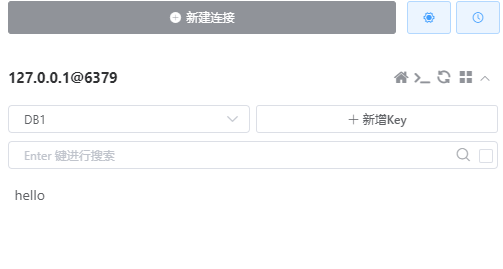

# 需要配置的内容：

## 1.redis连接配置

引用变量位置：MyRedisProperties.java --> private RedisProperties redisProperties;
配置变量位置：application.yml文件

```yml
server:
  port: 1234

redis:
  redisProperties:
        database: 5     # 配置程序启动时默认初始化的db
        host: localhost 
        port: 6379
        lettuce:
            pool:
                min-idle: 5
                max-idle: 10
                max-active: 8
                max-wait: 1ms
            shutdown-timeout: 100ms
```

# 调用测试：

## 通过接口形式调用
启动程序后，发送接口请求：
http://localhost:1234/switch-redis-db/test?db=1&key=hello&value=world
接口返回world
查看redis的1号db，发现已经将指定的键值对存进去了。

```java
@Slf4j
@RestController
@RequestMapping("/switch-redis-db")
public class TestEnhanceDataRedisController {

    /**
     * 默认数据源对应的redisHelper
     */
    @Autowired
    @Qualifier("redisHelper")
    private RedisHelper redisHelper;


    @GetMapping("/test")
    public ResponseEntity<String> testChangeDb2(@RequestParam int db, @RequestParam String key, @RequestParam String value) {
        redisHelper.strSetWithDb(db, key, value, 1000, null);
        return new ResponseEntity<>(redisHelper.strGetWithDb(db, key), HttpStatus.OK);
    }
}

```
